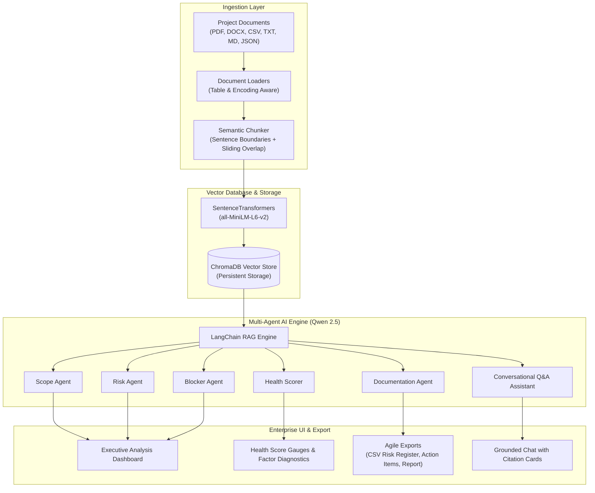

# 🤖 ProjectIQ: AI-Driven Enterprise Project Intelligence & Risk Advisor

[](https://www.python.org/downloads/)
[](https://streamlit.io/)
[](https://www.trychroma.com/)
[](https://www.langchain.com/)
[-purple.svg)](https://ollama.ai/)
[](#privacy--compliance)
[](LICENSE)

**ProjectIQ** is an enterprise-grade AI intelligence platform designed to automate project risk assessment, deliverable tracking, blocker identification, and agile documentation using **Retrieval-Augmented Generation (RAG)** and **specialized autonomous multi-agent AI**.

Engineered for enterprise security and privacy, ProjectIQ runs **100% locally** using Ollama (`qwen2.5:3b`) and SentenceTransformers, guaranteeing that proprietary project documentation never leaves your infrastructure.

---

## 🌟 Key Capabilities

### 1. 📄 Multi-Format Ingestion Engine
- Ingests **PDF**, Word **DOCX** (with full table parsing), **TXT**, **CSV** (structured tabular transformation), **Markdown**, and **JSON**.
- Automatically cleans control characters, formats tables, and sanitizes input data.
- Generates deterministic chunk IDs and tracks comprehensive document metadata.

### 2. 🧠 Smart Semantic Chunking & Vector Search
- **True Sliding Overlap**: Guarantees boundary context between chunks without truncating words or split sentences.
- **Dense Vector Search**: Powered by `all-MiniLM-L6-v2` embeddings (384 dimensions) and **ChromaDB**.
- **Ranked Multi-Source Retrieval**: Evaluates and ranks evidence across multiple uploaded project documents by similarity score.

### 3. 🤖 Autonomous Multi-Agent Intelligence
- 🎯 **Scope Agent**: Dynamically extracts project goals, objectives, milestones, deliverables, timelines, and RACI responsibilities across documents.
- ⚠️ **Risk Agent**: Discovers schedule vulnerabilities, external vendor dependencies, and forecasts delivery health (`ON TRACK` / `AT RISK` / `DELAYED`).
- 🚧 **Blocker Agent**: Isolates active work stoppages, pending decisions, architectural approvals, and assigns traceable action items.
- 📑 **Documentation Agent**: Generates Agile User Stories, formatted Risk Registers, and Action Items.

### 4. ❤️ Multi-Dimensional Project Health Scoring
Calculates an objective project health score (0–100) and operational status (`HEALTHY`, `STABLE`, `AT RISK`, `CRITICAL`) evaluated across 4 core pillars:
1. **Scope Clarity (25%)**: Breadth and specificity of goals, deliverables, and boundaries.
2. **Timeline Health (25%)**: Temporal analysis of milestones, deadlines, and delivery targets.
3. **Risk Status (25%)**: Weighted evaluation of identified delivery threats.
4. **Blocker Status (25%)**: Impact scoring of active work impediments.

### 5. 💬 Strictly-Grounded AI Assistant
- Conversational chat grounded strictly in verified document evidence.
- Anti-hallucination prompting ensures facts, owners, and dates are never fabricated.
- Transparent evidence traceability with expandable citation cards for every answer.

### 6. 📊 One-Click Agile Export Suite
- **Risk Register**: Export to CSV with Risk ID, Title, Reason, Impact, Probability, Severity, Mitigation, and Evidence.
- **Action Items Tracker**: Export to CSV with Action ID, Owner, Deadline, Priority, and Source.
- **User Stories Backlog**: Export to CSV with Story ID, Role-Goal-Benefit, and Priority.
- **Executive Report**: Generate and export an end-to-end Project Intelligence Report in Markdown.

---

## 🏗️ System Architecture



---

## 📁 Repository Structure

```
Ai_Project_Intelligence_Risk_Advisor/
├── app/
│   ├── agents/
│   │   ├── blocker_agent.py        # Autonomous blocker & action item detection
│   │   ├── documentation_agent.py  # Agile user story & risk register generator
│   │   ├── risk_agent.py           # Risk forecasting & mitigation agent
│   │   └── scope_agent.py          # Dynamic scope & deliverable extraction
│   ├── health/
│   │   └── health_scorer.py        # 4-dimensional project health scoring engine
│   ├── ingestion/
│   │   ├── csv_loader.py           # Structured tabular data converter
│   │   ├── docx_loader.py          # Word parser with table & bullet cleanup
│   │   ├── pdf_loader.py           # PDF extractor with page tracking
│   │   ├── txt_loader.py           # Multi-encoding text reader
│   │   ├── markdown_loader.py      # Markdown document loader
│   │   └── json_loader.py          # Structured JSON document loader
│   ├── models/
│   │   └── document.py             # Domain models (Document, RiskItem, UserStory, etc.)
│   ├── rag/
│   │   ├── chunker.py              # Sentence-aware chunker with sliding overlap
│   │   ├── embedding_model.py      # Singleton sentence-transformers wrapper
│   │   ├── langchain_embeddings.py # LangChain embedding adapter
│   │   ├── langchain_rag.py        # Score-ranked ChromaDB RAG retriever
│   │   ├── chromadb_store.py       # Standalone Chroma vector store
│   │   └── vector_store.py         # FAISS vector store alternative
│   ├── config.py                   # Centralized configuration & health diagnostics
│   ├── export.py                   # CSV and Markdown export utilities
│   └── pipeline.py                 # Document processing orchestration
├── data/
│   └── raw/                        # Sample project documents for testing
├── tests/
│   ├── test_suite.py               # Automated unit test suite
│   ├── test_chunker.py             # Chunker verification script
│   ├── test_csv_loader.py          # CSV loader verification script
│   ├── test_docx_loader.py         # DOCX loader verification script
│   ├── test_pdf_loader.py          # PDF loader verification script
│   ├── test_langchain_rag.py       # RAG retrieval verification script
│   └── ...
├── app.py                          # Streamlit Enterprise Web Dashboard
├── requirements.txt                # Production dependency specifications
└── README.md                       # Platform documentation
```

---

## 🚀 Quickstart Guide

### 1. Prerequisites
- **Python**: Version 3.10 or higher.
- **Ollama**: Download and install [Ollama](https://ollama.ai/).

Pull the local language model:
```bash
ollama run qwen2.5:3b
```

### 2. Environment Setup
Clone the repository and install the dependencies:
```bash
git clone https://github.com/Anagha-Dev25/Ai_Project_Intelligence_Risk_Advisor.git
cd Ai_Project_Intelligence_Risk_Advisor

python -m venv .venv
# On Windows:
.\.venv\Scripts\activate
# On Linux/macOS:
source .venv/bin/activate

pip install -r requirements.txt
```

### 3. Launch the Application
Run the Streamlit application:
```bash
streamlit run app.py
```
Open your browser at `http://localhost:8501`.

---

## 🧪 Automated Testing

Run the full automated test suite using Python's built-in test runner:
```bash
python -m unittest tests/test_suite.py
```

All tests run locally and validate:
- Ingestion loaders (TXT, CSV, DOCX, PDF)
- Text chunker boundaries and sliding overlap
- Document domain models and serialization
- Health scorer temporal pattern recognition
- Export generators (Risk Register CSV, Action Items CSV, Executive Markdown)
- Configuration diagnostics

---

## 🔒 Privacy & Compliance
- **Zero Cloud Leakage**: No project data is sent to external API endpoints (e.g. OpenAI, Anthropic).
- **Offline Capable**: All embeddings and LLM inferences execute locally on your machine or private VPC.
- **Audit-Ready Evidence**: Every AI-generated output is accompanied by verbatim evidence citations.

---

## 📄 License
This project is licensed under the MIT License - see the [LICENSE](LICENSE) file for details.
